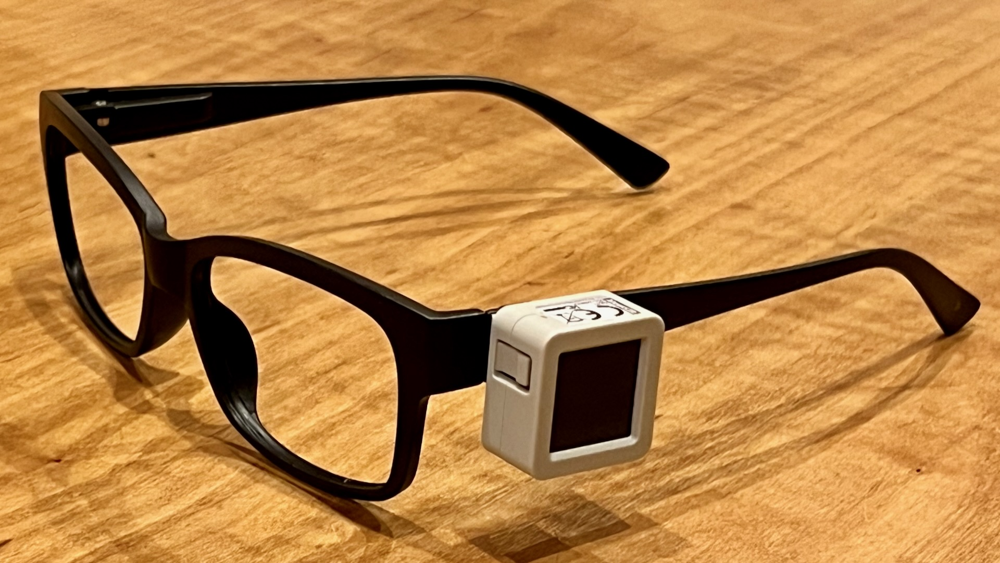
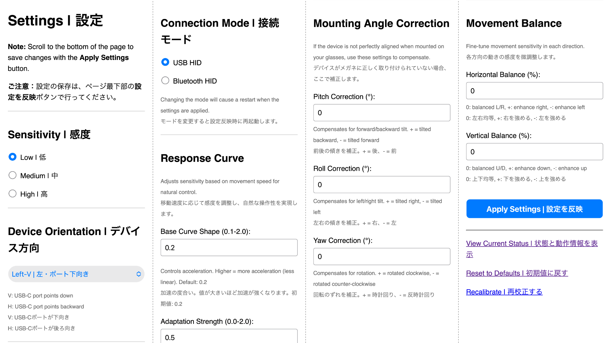

[English](README_en.md)

# メガネ型マウス

このメガネ型マウスは、一般的なマウスが備えている機能のうち、カーソル移動のみを提供します。クリック操作は、通常のマウス／トラックパッド／外部のスイッチなど、使いやすいものを組み合わせることができます。

- 開発：小林茂（＋Claude Code、Gemini）
- 開発協力：新井英夫

> 私が向き合っているのは進行性の難病で全身の筋肉がだんだんと動かなくなるALS（筋萎縮性側索硬化症）だ。「障害」が時間経過とともにどんどん変化していくので、「ちょうどいい」サポートの方法も常に変化していく。昨年冬にキーボードを今年の春から手でマウスを動かす操作が難しくなり、頭から上の首の動きは残存している私はパソコンやタブレットを操作する「ちょうどいい」方法を探していた。ALSがかなり進行してもっと動かなくなると目の動きだけでパソコンを操作する視線入力装置が主流となるが私にはまだ早い。今できる頭の動きを感知してマウス全般の機能を代替する既製品は存在していたので使ってみたが、多機能すぎて誤作動が多くフィットしなかった。さて困った！今の時代、デジタルデバイスでの情報受信と発信ができなくては社会から孤立してしまう。小林さんに相談したところ「機能をシンプルにポインターを動かすことに限定して、メガネ型の装置を作ってみましょう。クリックは少しだけ動く指で操作すればいい。マウスの操作すべてを盛り込むのではなく絞り込んで、後は新井さんがまだ使える身体能力に委ねる…そういうのどうでしょうか？」とご提案いただいた。「まさにそれそれ！そういうのを望んでいたんです！（笑）」と私。機能を足し算していくばかりではなく、引き算して「ちょうどいい」を創ってくれたのだ。
> 
> 私が直面していた問題と同じ悩みを抱える方たちにとってこの「小林メガネ」が「ちょうどいい」恩恵となることを、開発協力者として切に願っています。ちなみにこの文章も「小林メガネ」でポインターを手とほぼ同じように自在に操り、音声入力と画面上の仮想キーボードも合わせて使ってストレスなく入力しています。体感スピードとしては手が動かなくなる前とあまり変わらない感じです。（2025年10月27日 記す）
> 
> 新井英夫　体奏家　ダンスアーティスト

## 機能

- 頭の動きを精密なカーソル移動に変換（クリック機能なし）
- 2つの接続モード：USB HID（デバイス名：`AtomS3R`）とBluetooth HID（デバイス名：`MeganeMouse-BT`）の実行時切り替え
- 5つの取り付け方向に対応（左側面・縦向き／横向き、右側面・縦向き／横向き、後頭部・縦向き）
- WiFi経由のウェブインターフェイスによる簡単なセットアップと詳細なパラメーター調整
- 感度、応答カーブ、移動バランスのカスタマイズ
- 取り付け角度補正（3D回転補正）
- LCDに接続状態とデバイス情報を表示

## ハードウェア要件

- **M5Stack [AtomS3R](https://docs.m5stack.com/en/core/AtomS3R)**：開発ボード
- **USB-Cケーブル**：電源とデータ接続用
- **メガネ**：テンプル（つる）が平らで幅が広いもの（両面テープの安定した接着面を確保するため）
- **両面テープ**：3Mの[KRG-15](https://www.scotch.jp/3M/ja_JP/p/d/v101693093/)など、超強力かつ後から剥がせるもの
- **M5Stack [Tail Bat](https://docs.m5stack.com/en/atom/tailbat)**：Atomシリーズ用バッテリー（オプション、バッテリー駆動時）

## クイックスタート

### 1. ハードウェアを準備する

1. デバイス（AtomS3R）をメガネに両面テープで取り付ける
2. デバイスをUSB-CケーブルでPCに接続する

### 2. ファームウェアを書き込む

#### Arduino IDEの場合

1. [Arduino IDE](https://www.arduino.cc/en/software/)をインストールする
2. Arduino IDEで`MeganeMouse.ino`を開く
3. ボードをインストールする：`M5Stack`
4. 必要なライブラリをインストールする：
   - `M5AtomS3`（ライブラリの依存関係も含めて）
   - `NimBLE-Arduino`（Bluetoothサポート用）
5. ボードを選択する：`M5AtomS3R`
6. コードをアップロードする

#### M5Burnerの場合

1. [M5Stack Community](https://community.m5stack.com/)のアカウントを作成する
2. [M5Burner](https://docs.m5stack.com/en/uiflow/m5burner/intro)をインストールする
3. 画面上部の:bust_in_silhouette:ボタンをクリックし、登録したメールアドレスとパスワードでログインする
4. ウィンドウ左側のタブで`ATOMS3`を選択する
5. ウィンドウ上端の検索窓に`MeganeMouse`と入力し、本プロジェクトのファームウェアを選択する
6. `Download`ボタンを押してファームウェアをダウンロードする
7. `Burn`ボタンをクリックして表示される画面で適切なCOMポートを選択し、`Start`ボタンをクリックしてファームウェアを書き込む

### 3. 初期セットアップ

1. デバイスの電源を入れる。LCDが青色（電源ON）に点灯し、続いて黄色（校正プロセス開始）に変わります（下記参照）
2. 校正プロセス：
   1. 黄色の画面：動作検出（3秒間デバイスが静止するまで待機します）
   2. 赤色の画面：校正中（進捗を表示します）
   3. 緑色の画面：校正成功　または　オレンジ色の画面：校正失敗（代替として直近に保存された校正値を使用します）
3. デバイスは自動的に校正値を保存します

### 4. 設定

1. 本体ボタン（AtomS3Rの液晶画面）を長押し（2秒以上）してWiFiを有効化する（省電力のため初期状態では無効化しています）
2. WiFiネットワークに接続する：ネットワーク名は`MeganeMouse-WiFi`、パスワードは`MeganeMouse`
3. ブラウザで`192.168.4.1`にアクセスする
4. 表示されるウェブページで、接続方法（USB／Bluetooth）、デバイス方向、その他を必要に応じて設定する
5. ウェブページの`Apply Settings | 設定を反映`ボタンをクリックして設定を反映する
6. 本体ボタンを長押ししてWiFiを無効化する（接続方法の変更時には自動でデバイスが再起動します）

メインのウェブページから呼び出し可能な機能：

- `View Current Status | 状態と動作情報を表示`：現在のデバイス状態と動作情報を表示する
- `Reset to Defaults | 初期値に戻す`：すべての設定をデフォルトにリセットする
- `Recalibrate | 再校正する`：あらためて校正する（デバイスが安定した状態で実行してください）

## 設定オプション

### Sensitivity（感度レベル）

ヘッドマウスの全体的な応答性を選択：

- **Low | 低**：より遅く、より精密な動き、正確性が必要な詳細作業に最適
- **Medium | 中**：速度と精度のバランス（デフォルト）、一般的な使用に適している
- **High | 高**：より速く、より応答性の高い動き、高速ナビゲーションやゲームに最適

### Device Orientation（デバイス方向）

AtomS3Rをメガネにどのように取り付けたかに合わせて、設定を選択してください。

- 左側のテンプル（つる）に取り付けた場合:

  - `Left-V | 左側面・縦向き` (デフォルト)：デバイスが縦向き（USB-Cポートが下を向く）場合
  - `Left-H | 左側面・横向き`：デバイスが横向き（USB-Cポートが後ろを向く）場合

- 右側のテンプル（つる）に取り付けた場合:

  - `Right-V | 右側面・縦向き`：デバイスが縦向き（USB-Cポートが下を向く）場合
  - `Right-H | 右側面・横向き`：デバイスが横向き（USB-Cポートが後ろを向く）場合

- 後頭部（ストラップなど）に取り付けた場合:

  - `Back-V | 後頭部・縦向き`：デバイスが縦向き（USB-Cポートが下を向く）場合

V（縦方向）は、USB-Cポートが（メガネに対して）下を向くことを意味します。H（横方向）は、USB-Cポートが後ろを向くことを意味します。

### Connection Mode（接続モード）

接続モードの選択：

- **USB HID**：USBによる有線接続（遅延時間が最短）
- **Bluetooth HID**：Bluetooth Low Energyによる無線接続
- モード変更後は適切な初期化のためデバイスが再起動します

### Response Curve（応答カーブ）

応答カーブシステムは、使用者の操作パターンに応じて感度を調整することで、自然な適応性を備えたマウス操作を実現します。

#### Base Curve Shape（基本カーブ形状）

全体的な感度曲線を制御します。

- 値を小さく設定する（0.1～0.5）と、より直線的なレスポンスが得られ、精密な操作が可能になります。
- 値を大きく設定する（1.0～2.0）と、より積極的な加速効果が生まれ、素早い動きがしやすくなります。
- 初期値の0.2から始めて、頭部を素早く動かす際の速度向上効果を強めたい場合は数値を上げてください。

#### Adaptation Strength（適応強度）

カーブが使用者の操作パターンにどの程度適応するかを決定します。

- 速度に関係なく一貫したレスポンスを得たい場合は0.0に設定します。
- 高速操作時により敏感に反応させたい場合や、低速操作時の繊細な位置決めを滑らかに保ちたい場合は1.0～2.0に設定します。
- 初期値の0.5は、高速操作時の効果を高めつつ、低速操作時の感度が過剰にならないようバランスの取れた設定となっています。

#### 推奨する組み合わせ

- 精密制御：Base Curve Shape: 0.2、Adaptation Strength: 0.3
- バランス（デフォルト）：Base Curve Shape: 0.2、Adaptation Strength: 0.5  
- ゲーミング／高速：Base Curve Shape: 0.8、Adaptation Strength: 1.2

### Mounting Angle Correction（取り付け角度補正、単位は°）

デバイスの取り付け角度を補正したい場合に設定します（初期値はいずれも0）：

- **Pitch Correction（ピッチ補正）**：前後の傾きを補正（＋：後ろ向きに傾いているとき、−：前向きに傾いているとき）
- **Roll Correction（ロール補正）**：左右の傾きを補正（＋：右に傾いているとき、−：左に傾いているとき）
- **Yaw Correction（ヨー補正）**：回転のずれを補正（＋：時計回りに回転しているとき、−：反時計回りに回転しているとき）

### Movement Balance（移動バランス、単位は%）

各方向の動き感度を微調整したい場合に設定します（初期値はいずれも0）：

- **Horizontal Balance（水平バランス）**：左右の動き感度を調整（＋：右を強める、−：左を強める）
- **Vertical Balance（垂直バランス）**：上下の動き感度を調整（＋：下を強める、−：上を強める）

## トラブルシューティング

### カーソルが不規則に動く

- デバイスがメガネなどにしっかりと固定されていることを確認する
- 感度をより低い値に変更する
- ウェブインターフェイスの`Recalibrate | 再校正する`ボタンで再度校正する

### カーソルが動かない

- **USBモード**：データ通信可能なUSBケーブルで接続を使用し、デバイスがPC／タブレットに認識されることを確認する
- **Bluetoothモード**：デバイスがペアリングされ、LCDに「Connected」と表示されることを確認する
- デバイス方向が正しく設定されていることを確認する
- ウェブインターフェイスの`Recalibrate | 再校正する`ボタンで再度校正する

### Bluetooth接続の問題

- Bluetoothデバイスリストで「MeganeMouse-BT」を探す
- デバイスのLCDに「ADVERTISING」または「CONNECTED」が表示されることを確認する
- デバイスのペアリングを解除して再ペアリングを試す
- 電源投入時に本体ボタン（液晶画面）を3秒以上長押しして全てのBluetoothペアリングをリセットする
- 接続に失敗した場合はデバイスを再起動する

### 応答性が悪い

- 異なる感度レベルを試す
- 応答カーブ設定を調整する
- 取り付け角度補正を確認する
- デバイス方向設定が物理的な取り付けと一致することを確認する

### WiFiに接続できない

- ボタン長押しでWiFiを有効化する（画面が青緑色でフラッシュします）
- SSIDが`MeganeMouse-WiFi`のアクセスポイントを探す
- パスワードに`MeganeMouse`を入力する
- デバイスを再起動してみる

## 開発者向け情報

### 動作確認済みの組み合わせ

- Arduino IDE：v2.3.6
- M5Stack（ボード）：v3.2.3
- M5AtomS3（ライブラリ）：v1.0.2
- NimBLE-Arduino（ライブラリ）：v.2.3.6

### システムアーキテクチャ

- **更新レート**：50Hz（20ms間隔）
- **校正**：動作検出、進捗表示、自動リトライ（最大3回）、永続ストレージ、フォールバックシステム
- **フィルタリング**：動的アルファ値を持つ速度適応IIRフィルタ
- **座標系**：取り付け補正用の3D回転マトリックス

### 性能仕様

- **解像度**：サブ度単位のヘッド動作検出
- **レイテンシ**：約20msのエンドツーエンド処理時間
- **安定性**：自動ドリフト補正
- **範囲**：±45°の取り付け角度補正

### デバッグモード

カーソル制御の代わりにデバッグ出力を有効にするには：

1. `#define DEBUG_MODE 0`を`#define DEBUG_MODE 1`に変更する
2. 再コンパイルしてアップロードする
3. 115200ボーでシリアルモニターを開いてデバッグ情報を確認する

**注意**：M5AtomS3RのUSBコントローラーは、一度に1種類のデバイスとしてのみ動作できます（例：USB HIDマウスまたはシリアル／デバッグポートのどちらか一方）。USB HIDが有効な場合（`#define DEBUG_MODE 0`）には、USB経由のシリアル出力は無効になります。このため、コードを変更してデバッグモードを選択する必要があります。

### カスタマイズ

`Config`名前空間で主要パラメータを調整可能です：

- 感度除数
- 校正しきい値
- フィルタパラメータ
- 更新間隔

## ライセンス

このプロジェクトはGNU General Public License v3.0の下でライセンスされています。詳細は[LICENSE](LICENSE)ファイルを参照してください。

## 貢献

1. リポジトリをフォークする
2. 変更する機能用にブランチを作成する
3. 変更を加える
4. 十分にテストする
5. プルリクエストを送信する

## サポート

問題、質問、貢献については、プロジェクトリポジトリでイシューを開いてください。
